# OCEANLINES

## Mapping Earth's Hidden Waterworld

[](https://github.com/giodl73-repo/OCEANLINES/actions/workflows/validate.yml)

## Enter OCEANLINES

**[Explore the interactive Atlas 10 depth ladder →](atlas/)**

[Open the full annotated map](figures/oceanlines-fluid-geography.svg) ·
[Compare ocean-first projections](projections/) ·
[Read the field guide](HEATMASS.md) ·
[Open the research note](research/) ·
[Import the bibliography](REFERENCES.bib) ·
[Download the zone catalog](research/zone-catalog.csv) ·
[See how the Atlas is built](atlas/README.md) ·
[Check every source](SOURCE-REGISTER.md)

| If you want to… | Go here |
|---|---|
| See the idea in one image | [Full fluid-geography map](figures/oceanlines-fluid-geography.svg) |
| Compare ocean-first world geometries | [Projection laboratory](projections/) |
| Explore regions and observational layers | [Interactive Atlas](atlas/) |
| Understand reservoirs, anomalies, pathways, and gates | [HEATMASS field guide](HEATMASS.md) |
| Evaluate claims, receipts, and next measurements | [Research note](research/) |
| Reuse the framework in a spreadsheet | [Zone catalog](research/zone-catalog.csv) and [claims ledger](research/claims-ledger.csv) |
| Offer optional, bounded feedback | [Research review guide](REVIEW-GUIDE.md) |
| Follow the Antarctic and Arctic mechanisms | [OCEANREALMS](OCEANREALMS.md) |
| Inspect evidence, limitations, and provenance | [Atlas method](atlas/README.md) and [source register](SOURCE-REGISTER.md) |

The currently published site still serves
[Atlas 07](https://giodl73-repo.github.io/OCEANLINES/atlas/). Atlas 08 remains
the approved private review preview, Atlas 09 is the approved first depth
layer, and Atlas 10 is the native-role-approved pressure ladder on this branch.

> **Atlas 10 depth ladder:** this branch compares fixed July 2026 Scripps RG
> Argo temperature anomalies at 10, 300, 700, and 1000 dbar. The pressure-level
> views are not absolute temperature, vertically integrated heat content,
> transport, or Antarctic shelf delivery. Atlas 07 remains publicly released.



Most world maps end at the coastline. OCEANLINES starts there.

The ocean has its own geography: continent-scale reservoirs, fast boundary
currents, fronts, eddies, vertical layers, buried polar heat, and narrow gates
that control exchange. Unlike land, these provinces move, leak, split, merge,
and change identity with depth.

OCEANLINES develops a visual and quantitative atlas for that fluid geography.
Heat is the first revealing layer—not the only possible layer.

## Three map families

| Family | Question | Current artifact |
|---|---|---|
| **HEATMASS** | Where is heat stored, anomalously concentrated, or hidden? | [Planetary heat geography](HEATMASS.md) |
| **OCEANREALMS** | Which fronts, layers, topography, and budgets maintain a province? | [Heat zones are budgets](OCEANREALMS.md) |
| **OCEANBELTS** | Which comparisons survive when ocean bands are translated to gas giants? | [Gas-giant heat zones](OCEANBELTS.md) |

The names describe complementary objects: **OCEANLINES reveal HEATMASSES
inside OCEANREALMS**.

## Abyssal heat: source or transport?

The [abyssal-heat case](ABYSSAL-HEAT.md) asks whether the newly reported
acceleration of globally averaged abyssal warming is better explained by
changing heat from below or by changing circulation-mediated delivery. It
keeps observed warming, estimated seafloor source power, lithosphere and vent
opportunity, and modeled transport in four separate layers.

This is a source-qualified research design, not an OCEANLINES transport
result. It states what artifacts would make independent mapping and validation
possible.

## The measurement firewall

These quantities are related but not interchangeable:

1. temperature at a declared location, depth, and time;
2. heat content integrated through a declared water volume;
3. heat transport across a declared section;
4. temperature or heat-content anomaly relative to a declared climatology;
5. heat transformed or removed by the atmosphere, sea ice, or land ice.

A beautiful surface-temperature map cannot establish a full-depth heat budget.
Every figure states whether it is conceptual, observational, modeled, or
quantitative.

## Continue through the study

1. Explore the private [ATLAS 10 depth ladder](atlas/) for conceptual zones,
   surface observations, four Argo pressure levels, paired polar rings, the
   latitude ladder, and aligned polar-cap mirrors.
2. Compare Spilhaus, Oceanic Goode, Equal Earth, and experimental PELAGOS—or inspect each feature in the local [HEATPLATES shape atlas](projections/).
3. Read [HEATMASS](HEATMASS.md) for the map vocabulary.
4. Follow Antarctic heat through [OCEANREALMS](OCEANREALMS.md).
5. Test competing mechanisms in [EXPERIMENTS](EXPERIMENTS.md).
6. Frame source-versus-transport attribution in [ABYSSAL HEAT](ABYSSAL-HEAT.md).
7. Carry the measurement discipline to Jupiter and Saturn in [OCEANBELTS](OCEANBELTS.md).
8. Review the four falsifiable [PREDICTIONS](PREDICTIONS.md).
9. Check claim provenance in the [SOURCE REGISTER](SOURCE-REGISTER.md).

## Review organization

OCEANLINES uses eight functional [review roles](.roles/ROLE.md) for physical
oceanography, climate-data stewardship, cartography, public science,
accessibility, reproducibility, repository maintenance, and planetary
comparison. They organize internal quality control and do not replace external
scientific peer review. The latest synthesized atlas review is stored under
[`signals/roles/check/`](signals/roles/check/).

## Reproduce the scale ledger

The Python calculator converts a water-volume temperature excess or sustained
heat-transport rate into integrated energy and an ideal latent-melt equivalent.
The melt equivalent is an upper-bound unit conversion, not an ice-loss
forecast.

```powershell
cd analysis
python heat_zone_ledger.py --volume-km3 1 --temperature-excess-c 1
python heat_zone_ledger.py --power-tw 1 --duration-days 365.25
python -m unittest test_heat_zone_ledger.py
```

The calculator uses only the Python standard library.

## Project status

OCEANLINES is an early observation-class research and visual-atlas project.
The released Atlas 07 combines conceptual SVG geography with fixed NOAA OISST
absolute, anomaly, and estimated-error surface layers, a bookmarkable
coordinate probe, symmetric latitude-ring comparisons, and a 45-pair latitude
continuity scan plus aligned north/south polar-cap mirrors. It is not a live
ocean analysis or present-day forecast. The observed modes declare their
projections and include non-color regional, cell-level, ring-level, and
full-scan summaries; uncertainty remains product- and surface-specific.
This branch retains the approved private Atlas 08 presentation, researcher
note, claim-level literature spine, citation export, review guide, and
deterministic research tables. Atlas 09 added a separately receipted Argo-only
700 dbar anomaly; Atlas 10 extends it to a same-source four-level ladder without
changing the underlying OISST evidence. See the
[preview status](PREVIEW-STATUS.md) for the reviewed component commits and
remaining promotion decisions.
The abyssal-heat research design defines a reproducible transport-test
contract; no focal fields or solver outputs have been imported.

Public repository: [github.com/giodl73-repo/OCEANLINES](https://github.com/giodl73-repo/OCEANLINES).
Live atlas: [giodl73-repo.github.io/OCEANLINES/atlas/](https://giodl73-repo.github.io/OCEANLINES/atlas/).
The first hosted validation run passed both the offline suite and pinned NetCDF
fixture job on the approved Atlas 03 history.

## Atlas milestones

| Atlas | Commit | Evidence class | Fixed data date | Native role verdict |
|---|---|---|---|---|
| 00 | `10cf92b` | interactive conceptual geography | — | superseded by Atlas 03 review |
| 01 | `cd7f1b9` | NOAA OISST absolute SST | 2026-08-01 | superseded by Atlas 03 review |
| 02 | `31765f3` | absolute SST plus referenced anomaly | 2026-08-01 | superseded by Atlas 03 review |
| 03 | `3769594` | conceptual, absolute, anomaly, and estimated-error layers | 2026-08-01 | **APPROVED** · [review](signals/roles/check/oceanlines-atlases-roles-check-2026-08-21.md) |
| 04 | `a4ae7ca` | Atlas 03 layers plus accessible coordinate inspection | 2026-08-01 | **APPROVED** · [review](signals/roles/check/atlas-04-coordinate-probe-roles-check-2026-08-21.md) |
| 05 | `10daeee` | Atlas 04 plus paired northern/southern latitude-ring geometry | 2026-08-01 | **APPROVED** · [review](signals/roles/check/atlas-05-polar-rings-roles-check-2026-08-21.md) |
| 06 | `df78415` | Atlas 05 plus a 45-pair latitude-continuity ladder | 2026-08-01 | **APPROVED** · [review](signals/roles/check/atlas-06-latitude-ladder-roles-check-2026-08-21.md) |
| 07 | `666c2b3` | Atlas 06 plus aligned northern/southern polar-cap mirrors | 2026-08-01 | **APPROVED** · [review](signals/roles/check/atlas-07-polar-mirrors-roles-check-2026-08-21.md) |
| 08 preview | `4f6e9a2` | Ocean-first presentation plus researcher evidence and export surfaces; underlying OISST unchanged | 2026-08-01 | **APPROVED FOR PRIVATE PREVIEW** · [status](PREVIEW-STATUS.md) |
| 09 preview | `ef6662e` | Atlas 08 plus Scripps RG Argo potential-temperature anomaly at 700 dbar | 2026-07 | **NATIVE ROLES APPROVED; OWNER VISUAL REVIEW OPEN** · [review](signals/roles/check/atlas-09-argo-700dbar-roles-check-2026-08-28.md) |
| 10 preview | `2756f1e` | Atlas 09 plus same-source anomaly levels at 10, 300, and 1000 dbar | 2026-07 | **NATIVE ROLES APPROVED; OWNER VISUAL REVIEW OPEN** · [review](signals/roles/check/atlas-10-argo-depth-ladder-roles-check-2026-08-28.md) |

## License

MIT License. Copyright (c) Gio Della-Libera.
