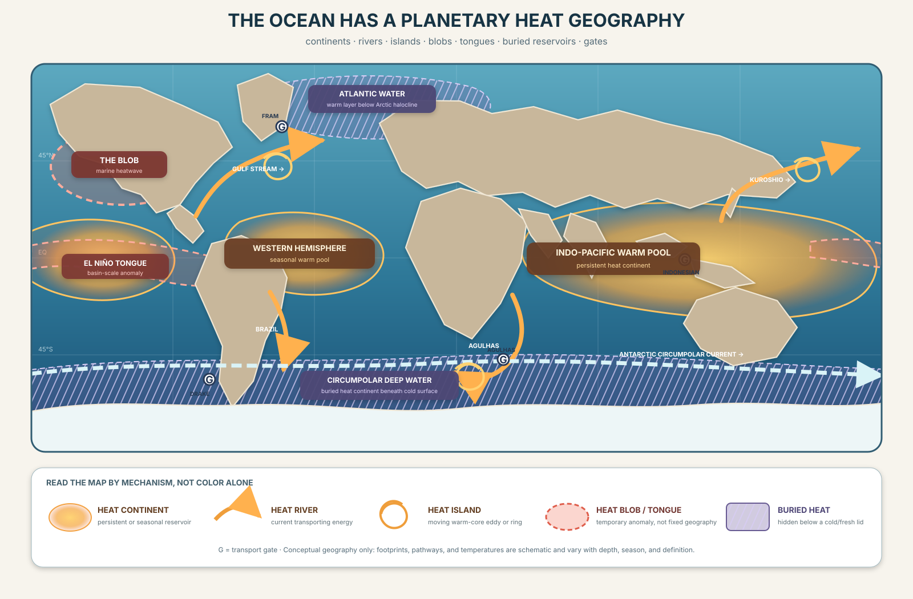

# OCEANLINES

## Mapping Earth's Hidden Waterworld

[](https://github.com/giodl73-repo/OCEANLINES/actions/workflows/validate.yml)



Most world maps end at the coastline. OCEANLINES starts there.

The ocean has its own geography: continent-scale reservoirs, fast boundary
currents, fronts, eddies, vertical layers, buried polar heat, and narrow gates
that control exchange. Unlike land, these provinces move, leak, split, merge,
and change identity with depth.

OCEANLINES develops a visual and quantitative atlas for that fluid geography.
Heat is the first revealing layer—not the only possible layer.

## Three map families

| Family | Question | Current artifact |
|---|---|---|
| **HEATMASS** | Where is heat stored, anomalously concentrated, or hidden? | [Planetary heat geography](HEATMASS.md) |
| **OCEANREALMS** | Which fronts, layers, topography, and budgets maintain a province? | [Heat zones are budgets](OCEANREALMS.md) |
| **OCEANBELTS** | Which comparisons survive when ocean bands are translated to gas giants? | [Gas-giant heat zones](OCEANBELTS.md) |

The names describe complementary objects: **OCEANLINES reveal HEATMASSES
inside OCEANREALMS**.

## The measurement firewall

These quantities are related but not interchangeable:

1. temperature at a declared location, depth, and time;
2. heat content integrated through a declared water volume;
3. heat transport across a declared section;
4. temperature or heat-content anomaly relative to a declared climatology;
5. heat transformed or removed by the atmosphere, sea ice, or land ice.

A beautiful surface-temperature map cannot establish a full-depth heat budget.
Every figure states whether it is conceptual, observational, modeled, or
quantitative.

## Start here

1. Explore [ATLAS 03](atlas/) for conceptual zones, absolute SST, SST anomaly,
   and time-matched estimated analysis error.
2. Read [HEATMASS](HEATMASS.md) for the map vocabulary.
3. Follow Antarctic heat through [OCEANREALMS](OCEANREALMS.md).
4. Test competing mechanisms in [EXPERIMENTS](EXPERIMENTS.md).
5. Carry the measurement discipline to Jupiter and Saturn in [OCEANBELTS](OCEANBELTS.md).
6. Review the four falsifiable [PREDICTIONS](PREDICTIONS.md).
7. Check claim provenance in the [SOURCE REGISTER](SOURCE-REGISTER.md).

## Review organization

OCEANLINES uses eight functional [review roles](.roles/ROLE.md) for physical
oceanography, climate-data stewardship, cartography, public science,
accessibility, reproducibility, repository maintenance, and planetary
comparison. They organize internal quality control and do not replace external
scientific peer review. The latest synthesized atlas review is stored under
[`signals/roles/check/`](signals/roles/check/).

## Reproduce the scale ledger

The Python calculator converts a water-volume temperature excess or sustained
heat-transport rate into integrated energy and an ideal latent-melt equivalent.
The melt equivalent is an upper-bound unit conversion, not an ice-loss
forecast.

```powershell
cd analysis
python heat_zone_ledger.py --volume-km3 1 --temperature-excess-c 1
python heat_zone_ledger.py --power-tw 1 --duration-days 365.25
python -m unittest test_heat_zone_ledger.py
```

The calculator uses only the Python standard library.

## Project status

OCEANLINES is an early observation-class research and visual-atlas project.
Atlas 03 combines conceptual SVG geography with fixed NOAA OISST absolute,
anomaly, and estimated-error surface layers. It is not a live ocean analysis or
present-day forecast. The observed modes declare their projection and include a
non-color latitude-band summary; uncertainty remains product- and surface-specific.

Public repository: [github.com/giodl73-repo/OCEANLINES](https://github.com/giodl73-repo/OCEANLINES).
The first hosted validation run passed both the offline suite and pinned NetCDF
fixture job on the approved Atlas 03 history.

## Atlas milestones

| Atlas | Commit | Evidence class | Fixed data date | Native role verdict |
|---|---|---|---|---|
| 00 | `10cf92b` | interactive conceptual geography | — | superseded by Atlas 03 review |
| 01 | `cd7f1b9` | NOAA OISST absolute SST | 2026-08-01 | superseded by Atlas 03 review |
| 02 | `31765f3` | absolute SST plus referenced anomaly | 2026-08-01 | superseded by Atlas 03 review |
| 03 | `3769594` | conceptual, absolute, anomaly, and estimated-error layers | 2026-08-01 | **APPROVED** · [review](signals/roles/check/oceanlines-atlases-roles-check-2026-08-21.md) |

## License

MIT License. Copyright (c) Gio Della-Libera.
